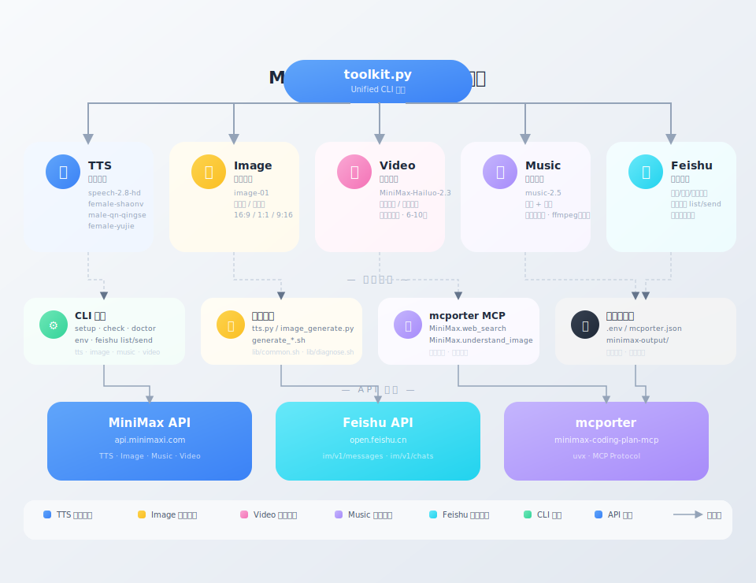

# MiniMax Toolkit

**OpenClaw + 飞书专属的 MiniMax 多功能工具包**

> 官方 minimax-multimodal-toolkit 的「OpenClaw 深度适配增强版」，专为飞书 + OpenClaw 工作流打造。

---

## 系统架构



---

## 核心亮点

**🤝 OpenClaw 深度适配**
- SKILL.md 触发词专为 OpenClaw Agent 调度逻辑优化，接入零门槛
- mcporter 集成图片理解 + 联网搜索，官方版没有这两个功能
- `toolkit.py` 统一 CLI，agent 只需一个命令即可了解全部状态

**🎯 Agent 友好**
- `python3 scripts/toolkit.py check --json` 输出机器可解析的状态 JSON
- 所有错误返回结构化错误码 + 修复建议，agent 精准定位问题
- `toolkit.py setup` 一键引导完成全部配置，真正开箱即用

**📤 飞书原生支持**
- 内置 `send_feishu_audio` / `send_feishu_image` / `send_feishu_native_video` 外挂脚本
- 生成内容直发飞书，图片/音频/视频一键气泡推送，官方版完全没有

**🛡️ 安全性更高**
- 动态路径，无硬编码用户名
- `.gitignore` 防误提交，`.env.example` 模板零配置上手
- `load_env()` 只读取必要变量，不会有多余 secrets 泄露到脚本环境

**🔄 容错机制**
- `tts.py` 主路径失败自动 fallback 直接调 API，不用担心脚本缺失
- 完整 error handling，区分超时 / 网络 / API 错误

---

## 功能对比

| | 官方版 | minimax-toolkit |
|---|---|---|
| TTS / 声音克隆 / 声音设计 | ✅ | ✅ |
| 图片生成（文生图 / 图生图） | ✅ | ✅ |
| 视频生成（文生视频 / 图生视频 / 首尾帧） | ✅ | ✅ |
| 音乐生成 | ✅ | ✅ |
| 媒体处理（格式转换/拼接/裁剪） | ✅ | — |
| 图片理解 + 联网搜索 | ❌ | ✅ via mcporter |
| 飞书推送（图片/音频/视频气泡） | ❌ | ✅ |
| `.env.example` 新手模板 | ❌ | ✅ |
| OpenClaw 触发词优化 | ❌ | ✅ |
| 安全性（动态路径 + 防泄露） | ⚠️ | ✅ |

---

## 安装方式

```bash
# 方式一：直接 git clone
git clone https://github.com/victor0602/minimax-toolkit.git
cd minimax-toolkit
cp .env.example .env
# 编辑 .env，填入你的 MINIMAX_API_KEY

# 方式二：通过 ClawHub 安装
clawhub install minimax-toolkit --workdir ~/.openclaw/workspace --dir skills
```

---

## 更新日志

### v1.4.0 (2026-04-04)

**Agent 友好重构：**
- 🚀 **统一 CLI `toolkit.py`**：所有功能通过单一入口调用，agent 无需了解内部脚本结构
- 📊 **结构化诊断**：`check --json` 输出机器可解析的 JSON 状态报告
- 🔍 **精确错误码**：所有错误返回 `E_*` 错误码 + message + hint，agent 可精准定位问题
- 🧩 **首次运行引导**：`setup` 命令引导用户完成全部配置和功能验证
- 🩺 **诊断函数库 `diagnose.sh`**：共享诊断逻辑，四个功能各一个检查函数

**Bug 修复：**
- 🐛 **tts.py fallback 修复**：fallback 直接调 API 时无法读取 `.env` 的问题，添加 `load_env()` 解决
- 🐛 **图片生成参数映射修复**：`image_generate.py` 的 Python 参数（下划线）现在正确转换为 shell flag（连字符）
- 🐛 **视频下载完整性验证**：下载后验证 HTTP status 和文件大小，防止静默失败
- 🐛 **poll 失败计数修复**：HTTP 4xx 响应正确计入重试次数，不再被忽略

**代码优化：**
- ♻️ **抽取共享库**：`load_env()` / `check_api_key()` 抽取为 `scripts/lib/common.sh`，消除四份重复代码
- ⚡ **list-voices 优化**：合并重复 API 请求，从两次减少为一次
- 🔒 **install-mcporter.sh 增强**：Python 读取环境变量增加校验，缺失时主动报错而非静默崩溃

**行为变更：**
- ⚠️ **图片下载默认行为调整**：`generate_image.sh` 下载默认关闭，需显式 `--download` flag，与音乐脚本行为一致

---

### v1.3.0 (2026-03-29)

**问题修复：**
- 🐛 **mcporter 安装脚本化**：新增 `install-mcporter.sh`，一键自动配置 MiniMax MCP 服务器
- 解决用户手动配置 mcporter 时路径/API Key 错误的问题
- SKILL.md 安装说明从手动步骤改为脚本调用，降低出错概率
- 新增安装后验证，自动检测 mcporter 是否正常运行

---

### v1.2.0 (2026-03-27)

**新增功能：**
- 🎵 **音乐生成**：支持 `music-2.5` 模型，可生成纯音乐或带歌词的歌曲
- 🎬 **视频生成**：支持 `MiniMax-Hailuo-2.3` 模型，文生视频 / 图生视频 / 首尾帧

**代码优化：**
- TTS 和图片生成脚本改为纯自包含，不依赖外部技能包
- 所有脚本移除了硬编码路径，兼容 macOS / Linux / Windows
- 新增 `.env.example` 模板文件，方便其他用户快速配置
- 新增 `.gitignore` 避免误提交 `.env` 和输出文件

**文档完善：**
- SKILL.md 新增完整的 mcporter 安装配置说明
- 修正音乐 API Key 说明（sk-cp- 和 sk-api- 的正确用途）

---

### v1.1.0 (2026-03-26)

- TTS 脚本重写，增加直接 API 调用 fallback
- 修复音频数据解析（支持多种响应格式）
- 新增 `--verbose` 模式和 `api` 子命令

---

## 快速开始

### 推荐：使用统一 CLI（一行命令完成所有操作）

```bash
# 首次使用：引导配置
python3 scripts/toolkit.py setup

# Agent 推荐：查看环境状态（机器可读）
python3 scripts/toolkit.py check --json

# 查看当前配置
python3 scripts/toolkit.py env --show

# 设置 API Key
python3 scripts/toolkit.py env --key sk-cp-your-key-here

# 语音合成
python3 scripts/toolkit.py tts "你好" -v female-shaonv -o output.mp3

# 图片生成（默认返回 URL，需 --download 才下载）
python3 scripts/toolkit.py image "一只猫" -o cat.png --download

# 音乐生成
python3 scripts/toolkit.py music --prompt "ambient electronic" --instrumental -o ambient.mp3

# 视频生成
python3 scripts/toolkit.py video --prompt "A cat on a moonlit rooftop" -o cat.mp4
```

### mcporter（图片理解 + 联网搜索）

```bash
bash scripts/install-mcporter.sh
openclaw gateway restart
mcporter list
```

## 工具调用示例

### 图片理解
```bash
mcporter call MiniMax.understand_image prompt: "描述这张图片" image_source: "https://example.com/image.jpg"
```

### 联网搜索
```bash
mcporter call MiniMax.web_search query: "今天北京天气"
```

### 语音合成
```bash
python3 scripts/tts.py tts "你好，欢迎使用" -v female-shaonv -o output.mp3
```

**可用音色：** `female-shaonv`（少女）、`male-qn-qingse`（青男）、`female-yujie`（御姐）等

## 文件结构

```
minimax-toolkit/
├── SKILL.md                # 技能说明文档（OpenClaw 用）
├── README.md               # 本文件
├── .env.example            # 环境变量模板
├── .gitignore              # Git 忽略配置
└── scripts/
    ├── toolkit.py          # 统一 CLI 入口（setup/check/env/tts/image/music/video）
    ├── setup.sh            # 首次运行引导脚本
    ├── check.sh            # 诊断检查入口
    ├── lib/
    │   ├── common.sh       # 共享函数库（load_env, check_api_key, error_exit）
    │   └── diagnose.sh     # 诊断函数库（check_* 系列）
    ├── install-mcporter.sh # mcporter 一键安装脚本
    ├── tts.py              # 语音合成入口
    ├── tts/generate_voice.sh
    ├── image_generate.py    # 图片生成入口
    ├── image/generate_image.sh
    ├── music/generate_music.sh
    └── video/
        ├── generate_video.sh        # 视频生成
        ├── generate_long_video.sh  # 长视频
        ├── generate_template_video.sh
        └── add_bgm.sh
```
